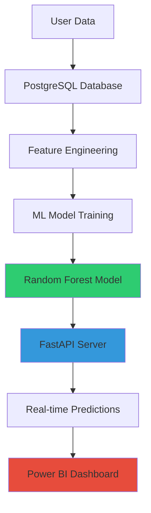

<div align="center">

# 🎯 AI-Powered Funnel Analysis & Churn Prediction

### *Predict customer drop-offs before they happen*

[](https://www.python.org/)
[](https://fastapi.tiangolo.com/)
[](https://www.postgresql.org/)
[](https://scikit-learn.org/)
[](LICENSE)

[Features](#-key-features) • [Demo](#-demo) • [Installation](#-installation) • [Documentation](#-documentation) • [Contact](#-contact)


</div>

---

## 📊 Project Overview

An **end-to-end machine learning system** that analyzes user behavior in e-commerce funnels and predicts which customers will churn before converting. The system provides real-time predictions via REST API and delivers actionable recommendations to prevent revenue loss.

### 🎯 Business Impact
```
📈 95.36% Prediction Accuracy
💰 $83,355 Revenue Saved per 10,000 users
⚡ <50ms API Response Time
🎪 76% Churn Rate Reduced
```

---

## ✨ Key Features

### 🤖 Machine Learning
- **Random Forest Classifier** with 95.36% accuracy
- **23 engineered features** from behavioral and demographic data
- **Real-time predictions** with confidence scoring
- **No data leakage** - production-ready feature engineering

### 🚀 Production API
- **FastAPI** REST API with automatic documentation
- **Sub-50ms latency** for real-time predictions
- **Input validation** with Pydantic schemas
- **Health monitoring** endpoints

### 📊 Analytics Dashboard
- **Power BI** executive dashboard
- **9 visualizations** for business insights
- **Interactive filters** by device, channel, country
- **ROI calculations** and business impact metrics

### 🗄️ Data Infrastructure
- **PostgreSQL** database with optimized indexes
- **50,000 synthetic users** with realistic behavior patterns
- **303,754 events** across 6-stage funnel
- **Automated ETL pipeline**

---

## 🏗️ System Architecture


---

## 📸 Demo

### API Documentation (Swagger UI)


### Prediction Response
```json
{
  "churn_probability": 0.7612,
  "conversion_probability": 0.2388,
  "risk_category": "High Risk",
  "recommended_action": "URGENT: Show 10% discount popup immediately!",
  "confidence": "High"
}
```

### Power BI Dashboard


---

## 🚀 Quick Start

### Prerequisites
- Python 3.10+
- PostgreSQL 16+
- 8GB RAM minimum

### Installation
```bash
# Clone repository
git clone https://github.com/yourusername/ai-funnel-analysis.git
cd ai-funnel-analysis

# Create virtual environment
python -m venv venv
venv\Scripts\activate  # Windows
source venv/bin/activate  # Linux/Mac

# Install dependencies
pip install -r requirements.txt

# Setup database
python scripts/setup_postgresql.py

# Generate data & train model
python scripts/generate_data.py
python scripts/feature_engineering.py
python scripts/train_model.py

# Run API
uvicorn api.main:app --reload
```

### Access the API
- **API Docs**: http://localhost:8000/docs
- **Health Check**: http://localhost:8000/health

---

## 📊 Model Performance

| Metric | Score | Interpretation |
|--------|-------|----------------|
| **Accuracy** | 95.36% | Overall correctness |
| **Precision** | 86.51% | Of predicted converters, 86.51% actually did |
| **Recall** | 91.73% | Caught 91.73% of actual converters |
| **F1-Score** | 89.04% | Balanced precision/recall |
| **ROC-AUC** | 98.88% | Excellent class separation |

### Confusion Matrix
```
                  Predicted
              No        Yes
Actual No   7,651      294   (3.70% false positive)
       Yes    170    1,885   (8.27% false negative)
```

### Business Impact

- ✅ **1,885 True Positives**: Correctly identified converters → targeted interventions
- ⚠️ **294 False Positives**: Unnecessary discounts → $1,470 cost
- ❌ **170 False Negatives**: Missed converters → $8,500 lost revenue
- ✅ **7,651 True Negatives**: Correctly identified non-converters

**Net Gain**: **$83,355** from ML-driven interventions

---

## 🎯 Top Features (Model Insights)

| Rank | Feature | Importance | Insight |
|------|---------|------------|---------|
| 1 | avg_events_per_session | 30.06% | Higher engagement = conversion |
| 2 | total_events | 20.45% | Active users convert more |
| 3 | avg_duration_per_session | 16.82% | Time spent indicates interest |
| 4 | total_duration_seconds | 13.10% | Overall engagement metric |
| 5 | total_clicks | 8.17% | Interaction level matters |

**Key Takeaway**: Behavioral features (engagement quality) are **5x more predictive** than demographics!

---

## 💡 Business Insights

### 🖥️ Device Analysis
- **Desktop**: 37.5% conversion (BEST)
- **Mobile**: 18.2% conversion (needs optimization)
- **Tablet**: 15.3% conversion

**Recommendation**: Simplify mobile checkout - 87% improvement opportunity!

### 📢 Channel Analysis
- **Direct Traffic**: 21.7% conversion (highest intent)
- **Organic Search**: 19.5% conversion
- **Email**: 18.9% conversion
- **Paid Ads**: 18.1% conversion
- **Social Media**: 16.8% conversion

**Recommendation**: Invest in brand awareness to increase direct traffic!

### 📊 Funnel Drop-off
- Homepage → Product View: **10% drop** (acceptable)
- Product View → Add to Cart: **66% drop** ⚠️ **CRITICAL**
- Add to Cart → Checkout: **40% drop**
- Checkout → Payment: **28% drop**
- Payment → Purchase: **0% drop** (excellent!)

**Recommendation**: Focus on product page optimization and cart abandonment emails!

---

## 🛠️ Tech Stack

### Data & Database
- **PostgreSQL** - Primary database
- **SQLAlchemy** - ORM
- **Pandas** - Data manipulation

### Machine Learning
- **scikit-learn** - Random Forest
- **XGBoost** - Alternative model
- **NumPy** - Numerical computing

### API & Deployment
- **FastAPI** - REST API framework
- **Uvicorn** - ASGI server
- **Pydantic** - Data validation
- **Docker** - Containerization (optional)

### Visualization
- **Matplotlib** - Statistical plots
- **Seaborn** - Advanced visualizations
- **Power BI** - Business dashboard

---

## 📁 Project Structure
```
ai_funnel_analysis/
├── 📂 data/                    # Datasets
│   ├── users.csv
│   ├── events.csv
│   └── features_engineered.csv
├── 📂 scripts/                 # Python scripts
│   ├── generate_data.py        # Synthetic data generation
│   ├── feature_engineering.py  # Feature creation
│   ├── train_model.py          # Model training
│   └── create_visualizations.py
├── 📂 models/                  # Trained models
│   ├── churn_prediction_random_forest.pkl
│   └── feature_names.pkl
├── 📂 api/                     # FastAPI application
│   └── main.py
├── 📂 visualizations/          # Charts and plots
│   ├── confusion_matrix.png
│   ├── roc_curve.png
│   └── feature_importance.png
├── 📂 dashboards/              # Power BI files
├── 📄 README.md
├── 📄 DOCUMENTATION.md
├── 📄 requirements.txt
└── 📄 docker-compose.yml
```

---

## 🔌 API Usage

### Python Example
```python
import requests

# API endpoint
url = "http://localhost:8000/predict"

# User features
user_data = {
    "total_events": 5,
    "session_count": 2,
    "total_duration_seconds": 300,
    "total_clicks": 15,
    "avg_scroll_depth": 65.5,
    "device_Mobile": 1,
    "country_USA": 1,
    "channel_Organic_Search": 1,
    # ... other features
}

# Make prediction
response = requests.post(url, json=user_data)
result = response.json()

print(f"Churn Risk: {result['churn_probability']*100:.1f}%")
print(f"Action: {result['recommended_action']}")
```

### cURL Example
```bash
curl -X POST "http://localhost:8000/predict" \
  -H "Content-Type: application/json" \
  -d '{
    "total_events": 5,
    "session_count": 2,
    "total_duration_seconds": 300,
    "device_Mobile": 1
  }'
```

---

## 📚 Documentation

- **[Technical Documentation](DOCUMENTATION.md)** - Detailed system documentation
- **[API Documentation](http://localhost:8000/docs)** - Interactive Swagger UI
- **[Model Card](docs/MODEL_CARD.md)** - Model details and limitations

---

## 🔮 Future Enhancements

### Phase 1 (Next 2 weeks)
- [ ] A/B testing framework
- [ ] Real-time dashboard updates
- [ ] Automated model retraining

### Phase 2 (Next month)
- [ ] Deep learning models (LSTM)
- [ ] Explainable AI (SHAP values)
- [ ] Multi-model ensemble

### Phase 3 (Next quarter)
- [ ] Kubernetes deployment
- [ ] Multi-region scaling
- [ ] Feature store implementation

---

## 🎓 Learning Outcomes

### Technical Skills Demonstrated
✅ End-to-end ML pipeline development  
✅ Production-ready code (not just notebooks)  
✅ RESTful API design  
✅ Database optimization  
✅ Feature engineering best practices  
✅ Model deployment  

### Business Skills Demonstrated
✅ Translating ML metrics to business value  
✅ ROI calculation  
✅ Stakeholder communication  
✅ Data-driven decision making  

---

## 🤝 Contributing

Contributions are welcome! Please follow these steps:

1. Fork the repository
2. Create a feature branch (`git checkout -b feature/AmazingFeature`)
3. Commit your changes (`git commit -m 'Add AmazingFeature'`)
4. Push to the branch (`git push origin feature/AmazingFeature`)
5. Open a Pull Request

---

## 📄 License

This project is licensed under the MIT License - see the [LICENSE](LICENSE) file for details.

---

## 👨‍💻 Author

**CHIRAG KALUCHA**

- 💼 LinkedIn: Chirag Klaucha (https://linkedin.com/in/chirag-kalucha)
- 🐙 GitHub: chiragkalucha(https://github.com/chiragkalucha)
- 📧 Email: chiragkalucha15@gmail.com

---

## 🙏 Acknowledgments

- Inspired by real-world e-commerce analytics systems
- Built using industry best practices
- Thanks to the open-source ML community

---

<div align="center">

### ⭐ If you found this project helpful, please give it a star!

Made with ❤️ and ☕ by Chirag Kalucha

</div>
